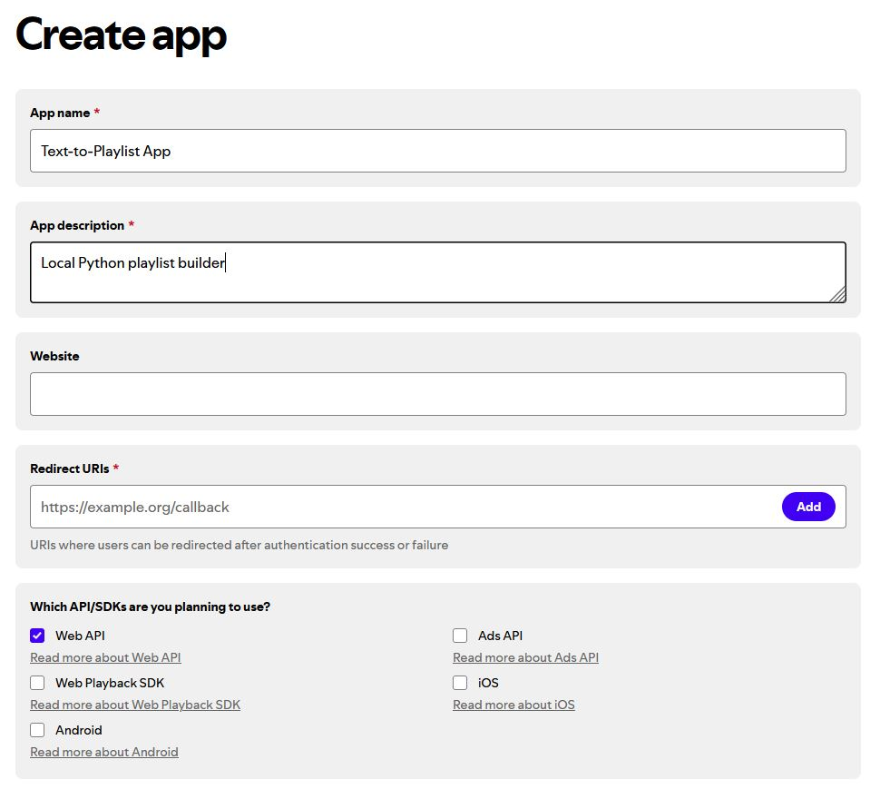
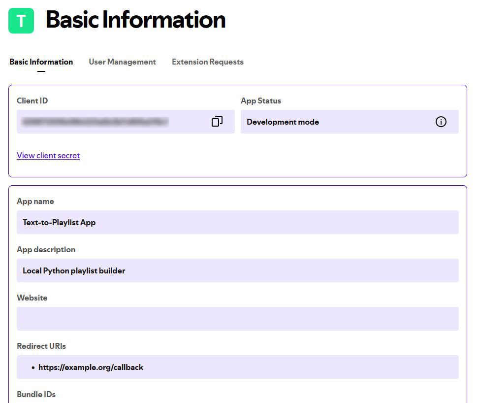

# LISTener's Friend

An interactive CLI program that converts album lists to Spotify playlists

_**Why?**_ When exploring new music I've always preferred listening to albums rather than "top" tracks or algorithmically generated playlists. The problem is that building playlists manually, say from a list like [this](https://rateyourmusic.com/list/funks/the_wires_100_most_important_records_ever_made/), takes a lot of copy-paste-searching and click-n-dragging, so I built this to make the process faster and easier.

- [LISTener's Friend](#listeners-friend)
  - [Getting Started](#getting-started)
  - [How It Works](#how-it-works)
    - [Basics](#basics)
    - [Authorization](#authorization)
    - [Standard Text Input](#standard-text-input)
      - [Option 1: Use txt file](#option-1-use-txt-file)
    - [Scraped Web Data Input](#scraped-web-data-input)
      - [Option 2: Use RateYourMusic List URL](#option-2-use-rateyourmusic-list-url)
      - [Option 3: Use Current Boomkat Bestsellers List](#option-3-use-current-boomkat-bestsellers-list)
      - [Option 4: Use Current Forced Exposure Bestsellers List](#option-4-use-current-forced-exposure-bestsellers-list)
      - [Option 5 \& 6: Browse and Select from WFMU's "Heavy Play" Archive](#option-5--6-browse-and-select-from-wfmus-heavy-play-archive)
      - [Options 7 \& 8: Browse and Select from Recent NTS Radio Broadcasts](#options-7--8-browse-and-select-from-recent-nts-radio-broadcasts)
  - [How to Get Spotify API Credentials](#how-to-get-spotify-api-credentials)
  - [On the Horizon](#on-the-horizon)

## Getting Started

1. Clone or download a copy of this repo.
2. Install the required dependencies: `pip install python-dotenv spotipy selenium bs4`
3. Rename the included `example.env` to `.env`, change the default input file path if desired, and update with your API credentials.
4. Run the program: `python listeners_friend.py`
5. Select type of input source from given options
   - Option 1: Add a list of albums in the format `artist - album`, each on a new line, to `input.txt`
   - Option 2, 6, 8: Provide a URL for supported source
   - Options 3, 4: No user input needed, fully automated
   - Options 5, 7: Interactive user input selection
6. A new playlist will be created directly in your Spotify account, ready to play!

## How It Works

### Basics

- User is authenticated with the Spotify API, either using the API credentials stored in the `.env` file or an existing token stored in the `.cache` file
- The chosen data source is read and the necessary information is parsed into an array of tuples in the form `[(artist, album)]` which serves as the finalized input
- A playlist name and description are either provided by the user (op. 1), taken directly from the data source (op. 2), or auto-generated (op. 3)
- The finalized input is looped through and the Spotify library is queried for each entry with `q="album:{album} artist:{artist}"` limited to the album data type with a maximum result quantity of 1 so that only the top matching result (if any) is grabbed
- The album match data is parsed for its URI string
- Albums which are't found are added to a separate list
- The API is again queried using the album URI to fetch the tracklist data
- Tracklist data is parsed for each individual track's URI
- Once tracks have been gathered for every album URI, a count is taken of the albums not found and this is prepended to the playlist description in the form `"### {albums or tracks} not found.`
- A text file is saved to the current directory which contains the `artist - {album or track}` info for each album or track not found
- The necessary info is sent to the user's account for the creation of a new playlist and its ID is retrieved
- Track URIs are posted to the new playlist

:warning: _**Spotify API Limitations**_ :warning:

- Only individual tracks or podcast episodes, not albums, can be added to playlists, so this is why URIs for each individual track on an album are collected rather than just posting the album URI to the playlist
- Only 100 tracks can be posted to a playlist at a time so large lists of track URIs are broken into chunks of 100 or less before being sent
- A Spotify playlist can have a maximum of 11,000 tracks, which you can certainly run up against if using a huge RYM list, and in those cases two playlists will be created `{playlist name} (Part 1)` with the first 11,000 tracks and `{playlist name} (Part 2)` with the overflow.

### Authorization

:warning: _It is necessary to have Spotify API credentials stored in the `.env` file. If you need help, see the [guide](#how-to-get-spotify-api-credentials) at the end of this doc for details._ :warning:

The first time you run the program you'll be sent to a Spotify authorization page in your browser. It should be asking you if you want to allow connecting to { _whatever you named your app when getting your API credentails_ }. After this you'll be routed to your Redirect URI. Copy the <u>full</u> URL and paste it into the command prompt to finalize authorization. Your OAuth token will be stored in the `.cache` file.

### Standard Text Input

#### Option 1: Use txt file

- Filepath is read from the `.env` file, default is `./input.txt`
- Input in the form of `artist - album \n` is parsed from the text file into the finalized input array
- User is prompted to enter a _name_ and an (optional) _description_ for the new playlist

### Scraped Web Data Input

Lists hosted on supported websites can be scraped using Selenium and BeautifulSoup to build the finalized input array

:warning: _If you are running the program in Bash you may have difficulty entering a URL for options 2 or 8!_ :warning:

#### Option 2: Use RateYourMusic List URL

- The URL for a list at [RateYourMusic](https://rateyourmusic.com/lists/) can be supplied as an input source
- Playlist name is automatically set to the name of the list and description is set to the list description (truncated if it runs beyond Spotify's 300 character limit)
- The program will iterate through multi-page lists _but_ you may experience a premature end due to RYM's use of the occasional random CloudFlare captcha
  - A way to circumvent this is tba, for now just retry or pass in the URL of the page where it stopped

#### Option 3: Use Current Boomkat Bestsellers List

- The [Boomkat Bestsellers](https://boomkat.com/bestsellers?q[release_date]=last-week) list is used as input source
- Playlist name is automatically set to `Boomkat Bestsellers` and the description is set to `For the week ending YYYY-MM-DD`, where date is the day the data was gathered
- Timespan default is one week but can be changed by modifying the (hardcoded) source URL `https://boomkat.com/bestsellers?q[release_date]=last-week` where `last-week` can be replaced with `last-month` or `last-year`.

#### Option 4: Use Current Forced Exposure Bestsellers List

- The [Forced Exposure Bestsellers](https://forcedexposure.com/Best/BestIndex.html) list is used as input source
- Playlist name is automatically set to `Forced Exposure Bestsellers` and the description is set to `As of YYYY-MM-DD`, where date is the day the data was gathered
- Forced Exposure doesn't offer any alternate timespans and it's not clear how often the list is updated

#### Option 5 & 6: Browse and Select from WFMU's "Heavy Play" Archive 

- Browse the [WFMU "Heavy Play" archive](https://www.wfmu.org/Playlists/Wfmu/) by date
- Provide a year and receive a list of dated lists to select as an input source
  - Current Limitations:
    - 1987-1996 lists are only available as PDF downloads
    - 1997 to late 2018 vary in format and structure and have inconsistent support at the moment
- Generates a playlist name `WFMU Heavy Play {Month DD, YYYY}` and a description `{#} albums not found.`
- Option 6 offers the ability to skip the browsing and provide a list URL directly (date limitations still apply!)

:warning: _These can be pretty huge (as in a few thousand songs) so they take a little longer to build than other options and the playlists themselves can be a little slow in your Spotify client!_ :warning:

#### Options 7 & 8: Browse and Select from Recent NTS Radio Broadcasts

- Differs from the standard options in that this is a track-based playlist builder
- Browse the latest from [NTS Radio](https://www.nts.live/)
- Returns the 12 most recent [broadcasts](https://www.nts.live/latest), including date, name of the program, broadcast location, and any tags
- Generates a playlist name `NTS: {broadcast title} ({dd.mm.yy})` and description `{#} tracks not found.{original episode description}. Broadcast: {YYYY-MM-DD}, {location}`
- Number of episodes returned can be modified by changing the value of `limit=12` at the beginning of the `handle_nts_latest` function.
- Option 8 offers the option to skip the browsing and provide an episode URL directly

## How to Get Spotify API Credentials

To get the necessary info for your `.env` file you'll first need a (free) [Spotify Developer](https://developer.spotify.com/) account.

1. After logging in and landing on the dev dashboard click _Create app_.

   

2. Fill out the required fields:
   - Give your app a name (i.e. _Text-to-Playlist App_) and a brief description, maybe something to remind you why you made it.
   - For the Redirect URI you can supply your own or just use https://example.org/callback. Click _Add_.
   - Check the box for _Web API_ access and save.
3. After creating the app you'll be taken to its dashboard. Click _Settings_ in the top right corner. Everything you need for your `.env` file is here on this page:

   

4. Copy the _Client ID_ and _Client Secret_ (click _View client secret_) to your `.env` file. If you forgot what Redirect URI you chose earlier you can also grab that from here. The `example.env` is prepopulated with `https://example.org/callback`.
5. You're ready to start building playlists!

## On the Horizon

- [ ] option to add to existing playlists (with duplicate detection)
- [ ] a pretty GUI
